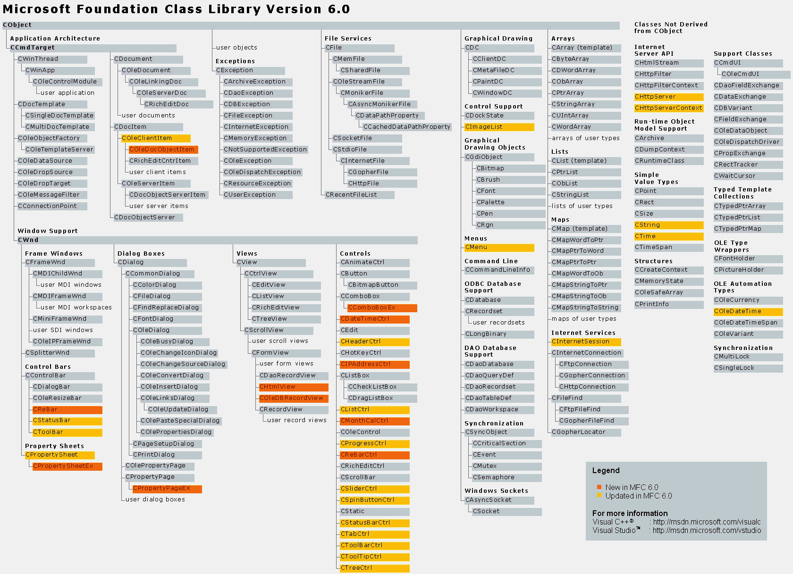

# MFC 구조
- 최상위 클래스인 CObject가 제공하는 서비스와 전역함수를 알아보자.




------------------------------------
<br>


## CObject Class
- MFC의 최상위 클래스로, 전체 클래스의 80%정도가 CObject의 파생 클래스이다.
- CObject 클래스가 제공하는 멤버 변수와 멤버함수의 개수는 많지 않으나 MFC 응용 프로그램을 구동하는 데 필수적인 기능을 제공한다.
- 객체 교류의 단일화를 구현하기 위하여 최상위 클래스를 통일하기 위해 노력한다.

| Service Name | func |
|:--------:|:--------:|
| 실행 시간 클래스 정보 | 프로그램 실행 중 객체 정보를 알아낸다. |
| 동적 객체 생성 | 객체를 동적으로 생성한다. |
| 직렬화 | 객체를 저장하거나 읽어들인다. |
| 타당성 점검 | 객체 상태를 점검한다. |
| 집합 클래스와의 호환성 | 서로 다른 클래스 객체를 집할 클래스에 저장할 수 있다. |

- MFC 클래스는 물론이고 사용자 정의 클래스도 직접 혹은 간접적으로 CObject 클래스를 상속받으면 표에 있는 CObject 서비스를 사용할 수 있다.

--------------------------

## 실행 시간 클래스 정보
- 프로그램 실행 중에 객체 정보를 알아낼 수 있다.

- 객체 정보란 해당 객체의 타입 정보(클래스 이름, 베이스 클래스 정보), 객체 크기 등을 의미한다.

```C++
/* MyClass.h */
class CMyClass : public CObject
{
    DECLARE_DYNAMIC(CMyClass)
    ...
};

/* MyClass.cpp */
IMPLEMENT_DYNAMIC(CMyClass, CObject)
```
- `두 개의 매크로`를 클래스 선언부와 정의부에 각각 포함시켜야 기능을 사용할 수 있다.

```C++
BOOL IsMyClass(CObject *pObj)
{
    // pObj가 가리키는 객체가 CMyClass 타입인지 확인한다.
    if(pObj->IsKindOf(RUNTIME_CLASS(CMyClass))) 
    {

    }   
    else 
    {

    } 
}
```
-----------------------
<br>


## 동적 객체 생성
- 메모리를 동적으로 할당받아 객체를 생성할 수 있다.

- 이 기능을 사용하려면 두 개의 `매크로`를 클래스 선언부와 정의부에 각각 포함시켜야 하며, 클래스의 `기본 생성자`가 반드시 존재해야 한다.
```C++
/* MyClass.h */
class CMyClass : public CObject
{
    DECLARE_DYNCREATE(CMyClass)
  public:
    CMyClass();                 // 기본생성자가 존재해야 한다.
    ...
};

/* MyClass.cpp */
IMPLEMENT_DYNCREATE(CMyClass, CObject)
```

```c++
// 객체를 동적으로 생성한다.
CRuntimeClass *pRuntimeClass = RUNTIME_CLASS(CMyClass);
CObject pObject = pRuntimeClass->CreateObject();

// 객체 생성 여부를 확인한다.
ASSERT(pObject->IsKindOf(RUNTIME_CLASS(CMyClass));)
```
- CRuntimeClass::CreateObject() 함수는 객체를 동적으로 생성하고 객체의 주소값을 리턴한다.
-----------------------
<br>

## 직렬화(Serialization)
- 객체 내용을 파일에 저장하거나 파일에서 읽어올 수 있다.
- 마찬가지로 두 개의 매크로를 클래스 선언부와 정의부에 각각 포함시켜야 한다.
- 기본 생성자가 반드시 존재해야한다.
- Serialize() 또한 재정의하여야 한다.

```C++
/* MyClass.h */
class CMyClass : public CObject
{
    DECLARE_SERIAL(CMyClass)
    ...
  public:
    CMyClass();                                 // 기본생성자
    virtual void Serialize(CArchive& ar);       // 가상 함수를 재정의
};

/* MyClass.cpp */
IMPLEMENT_SERIAL(CMyClass, CObject, 1)

void CMyClass::Serialize(CArchive& ar)
{
    // CObject 클래스가 제공하는 가상 함수인 Serialize()를 재정의한다.
}
```

| Level | Purpose | Name | Location
| :---: | :---: | :---: | :---: 
| 1 | 실행 시간 클래스 정보 | DECLARE_DYNAMIC | 클래스 선언부(*H)
||| IMPLEMENT_DYNAMIC | 클래스 정의부(*.CPP)
| 2 | 실행 시간 클래스 정보, 동적 객체 생성 | DECLARE_DYCREATE | 클래스 선언부(*H)
||| IMPLEMENT_DYCREATE | 클래스 정의부(*.CPP)
| 3 | 실행 시간 클래스 정보, 동적 객체 생성, 직렬화 | DECLARE_SERIAL | 클래스 선언부(*H)
||| IMPLEMENT_SERIAL | 클래스 정의부(*.CPP)|
- 높은 레벨의 단계는 하위 기능을 모두 포함 하고 있다.
-------------
<br>

## 타당성 점검(Validity Check)
- 객체의 내부 상태가 정상인지 판단하는 기능을 한다.
- CObjec 클래스가 제공하는 가상 함수인 AssertValid()를 재정의한 후 객체의 타당성 여부를 점검하는 코드를 작성하면 된다.
- AssertValid() 함수는 사용자가 직접 호출할 수 있지만 MFC 내부에서 자동으로 호출하는 경우도 있다.
```C++
/* MyClass */
class CMyClass : public CObject
{
    // 멤버 변수
    int m_start, m_end;
  public:
    virtual void AssertValid() const;       // 가상 함수를 재정의
    ...
};

/* MyClass.cpp */
#include "MyClass.h"

virtual void CMyClass:AssertValid() const
{
    CObject::AssertValid();
    ASSERT(m_start > 0);             
    ASSERT(m_end < 100);            
}
```
--------------------
<br>

## 집합 클래스와의 호환성
- CObject를 직/간접적으로 상속받은 클래스 객체는 모두 CObject 타입으로 간주할 수 있다.
- 여러 종류의 객체를 하나의 자료 구조로 관리하고자 할 때 편리하다.

| Type | Class Name |
|:--------:|:--------:|
| Array | CObArray, CArray(Template) |
| List | CObList, CList(Template) |
| Map | CMapWordToOb, CMapStringToOb, CMap(Template) |
