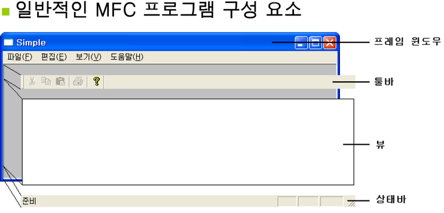
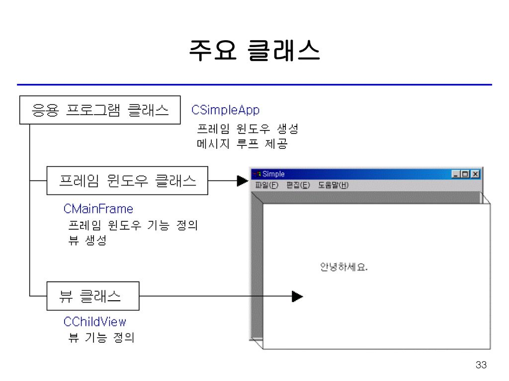

# 응용 프로그램 마법사를 이용한 MFC 응용 프로그램

- 일반적인 SDK 프로그램과 달리 MFC 프로그램은 최소 두 개의 윈도우로 구성된다.
- 프로그램의 가장 바깥쪽 틀에 해당하는 윈도우를 프레임 윈도우(메인 윈도우)라고 부른다.
- 프레임 윈도우의 클라이언트 영역((툴바, 뷰, 상태바))을 덮고 있는 윈도우를 뷰라고 부른다.
- 두 개의 윈도를 다루기위해 두 개의 클래스가 존재한다.

- 프레임 윈도우와 뷰는 부모-자식 관계이다.
    - 항상 부모 윈도우의 클라이언트 영역 내에 위치한다. 클라이언트 영역을 벗어나는 부분은 잘려서 보이지 않는다.(클리핑(Clipping))
    - 두 윈도우는 같이 움직이며, 숨겨지고 파고된다.

-------------
 

## 마법사가 생성한 MFC 응용 프로그램 코드 분석

### 응용 프로그램 클래스
- SDK 프로그램의 WinMain() 함수의 역할을 한다.
- 메시지 루프를 제공하는 함수는 CWinApp:Run()인데, MFC 내부적으로 자동으로 호출되므로 본문에는 나타나지 않는다.

### 프레임 윈도우 클래스 
- 프레임 윈도우 클래스는 프레임 윈도우의 기능을 정의한다.
- 프레임 윈도우의 클라이언트 영역을 차지하는 뷰도 같이 생성한다.

### 뷰 클래스
- 화면에 데이터를 출력한다.
- 사용자 입력(마우스, 키보드 ... )을 받는다.
----------------------

## 정리

| 클래스 종류 | 베이스 클래스 | 핵심 함수 - 주 역할
|:--------:|:--------:|:------:|
| 응용 프로그램 클래스 | CWinApp | InitInstance() - 프레임 윈도우 생성
|||Run() - 메시지 루프 제공
| 프레임 윈도우 클래스 | CFrameWnd | OnCreate() - 뷰 생성
| 뷰 클래스 | CWnd | OnPaint() - 화면 출력, 사용자 입력

- 프로그램 외/내부에서 메시지가 발생하면, 메시지는 메시지 큐에 저장된다.
- CWinAPp::Run() 함수는 내부적으로 메시지 큐에서 메시지를 꺼내서 윈도우 프로시저에 전달한다.

- 특정 메시지가 MFC 메시지 맵으로 연결되어 있다면 해당 윈도우의 메시지 핸들러가 호출된다.
- 나머지는 ::DefWindowProc()가 자동으로 처리한다.