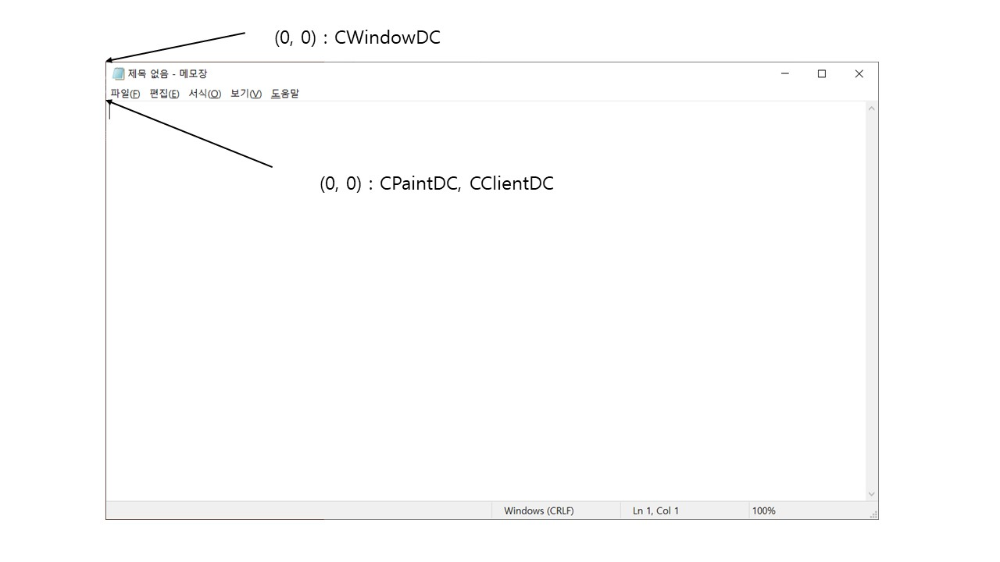

# CDC Class

## SDK vs MFC 출력 과정
### SDK
1. 운영체제에 DC(Device Context)를 요청해서 얻는다.
2. DC를 전달 인자로 해서 API 함수를 호출하여 출력한다.
3. 디바이스 컨텍스트 사용이 끝났음을 운영체제에 알린다.

### MFC
1. DC 객체를 생성한다.
2. 객체의 멤버 함수를 호출하여 출력한다.

### 디바이스 컨텍스트 클래스(CDC 파생 클래스)
| 클래스 이름 | 용도 |
|:--------:|:--------:|:------:|
| CPaintDC    | 클라이언트 영역에 출력할 때(WM_PAINT)
| CClientDC   | 클라이언트 영역에 출력할 때(WM_PAINT 제외한 다른 모든 곳)
| CWindowDC   | 윈도우 전체 영역(클라 + 비클라)에 출력
| CMetaFIleDC | 메타파일(Metafile)를 출력할 때

----------------------
<br>

## CPaintDC Class
- WM_PAINT 메시지 핸들러에서만 사용할 수 있다.
- 클라이언트 영역에 출력한다.
```c++
void CChildView::OnPaint()
{
    CPaintDC dc(this);
}
```
- 위의 코드가 자동 생성되어 있는 것을 볼 수 있음.
- this 포인터는 뷰 객체의 주소를


## CClientDC Class
- WM_PAINT 메시지 핸들러 제외한 다른 모든 곳에서 사용한다.
- Ex.) OnLButtonDown() , etc ....
- 클라이언트 영역만 출력한다.


## CWindowDC
- 윈도우 전체 영역(클라 + 비클라) 출력할 수 있다.

- 좌표의 원점 위치가 다르다.


## CMetaFileDC Class
- 메타 파일(MetaFile) : 그리기 명령의 집합으로, 메모리에 임시로 생성하거나 디스크 파일에 영구히 저장할 수 있다.
- 만들어진 메타 파일을 재생하면 저장된 그리기 `명령`들을 한꺼번에 수행하여 그림을 그릴 수 있다.

- `명령 자체`가 저장되어 있기 때문에 확대, 축소시 깨지지 않지만, 속도가 느리다.

### 메타파일 사용 순서
1. CMetaFileDC 객체를 만들고 CMetaFileDC::CreateEnhanced() 함수로 초기화한다. 호출 인자에 따라 확장 메타파일을 메모리에 생성할 수 잇고, 디스크 파일(.emf)에 저장할 수 있다.
2. 확장 메타파일 객체를 일반 DC객체로 간주하여 출력 함수를 호출한다.
3. CMetaFileDC::CloseEnhanced() 함수를 호출하면, 윈도우 운영체제가 내부적으로 확장 메타파일을 만든 후 핸들(HENHMETAFILE)을 리턴한다.
4. 확장 메타파일 핸들을 CDC::PlayMefaFile() 함수에 전달하여 재생하면 저장된 명령들이 수행되어 출력된다.

5. 확장 메타파일 사용이 끝나면 핸들을 ::DeleteEnhMetaFaile() API 함수에 전달하여 삭제한다.