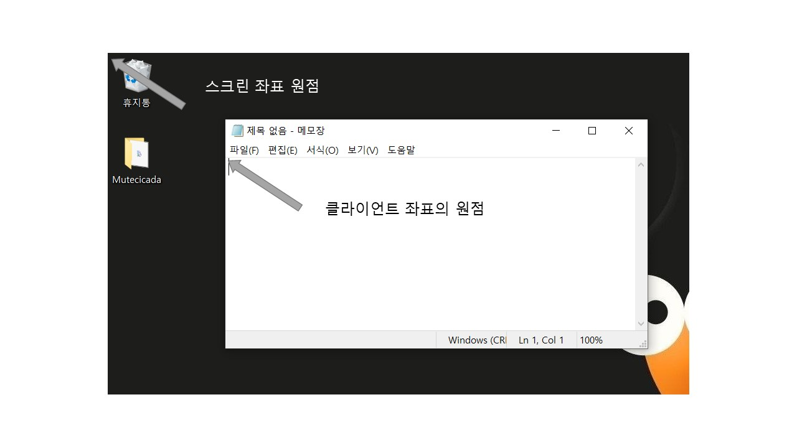
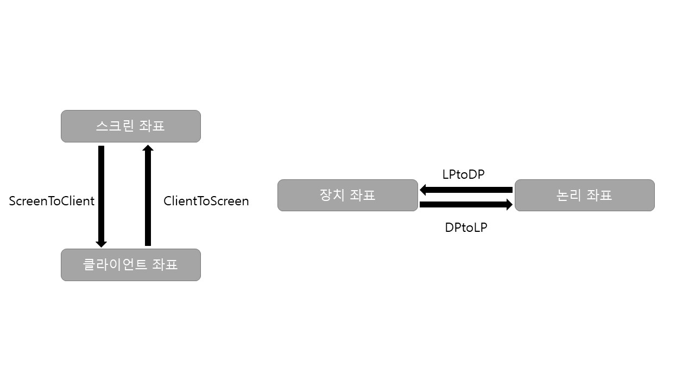

# 그리기 함수

## 점 찍기
| 이름 | <center> 기능 </center> |
|:--------:|:--------|
| GetPixel() | 화면 (x, y) 지점의 색을 얻는다. |
| SetPixel() | 화면 (x, y) 지점에 특정 색상의 점을 찍고 원래 점의 색을 리턴한다. 
| SetPixelV() | SetPixel() 함수와 출력은 같지만 원래 점의 색을 리턴하지 않아 속도가 조금 더 빠르다. |

## 선 그리기
| 이름 | <center> 기능 </center> |
|:--------:|:--------|
| MoveTo() | 현재 위치를 (x, y)위치로 옮긴다. |
| LineTo() | 현재 위치에서 (x, y) 위치까지 선을 그리고, 현재 위치를 (X, y)로 변경한다.
| Polyline() | POINT 구조체 배열로 전달된 점들을 차례로 이어서 선을 그린다.(그래프에 유용) |

## 텍스트 함수
| 이름 | <center> 기능 </center> |
|:--------:|:--------|
| TextOut() | (x, y) 위치에 문자열을 출력한다. |
| DrawText() | 직사각형 영역 내부에 문자열을 출력한다. | 
| SetTextColor() | 글자의 색을 바꾼다. |
| SetBkColor() |  글자의 배경색을 바꾼다. |
| SetTextAlign() | 기준 위치에 대한 문자열 정렬 방식을 설정한다. |

## 매핑 모드
- 대부분의 GDI 함수에서 사용하는 단위는, 프로그래머가 직접 사용하는 논리 단위(Logical Unit)이다.
- 운영체제 내부적으로 사용하는 단위는 피셀을 기본으로 하는 장치 단위(Device Unit)이다.

- 정해진 규칙에 따라 프로그래머가 사용하는 논리 단위를 장치 단위로 변환하는 방법을 나타내는 용어가 매핑 모드(Mapping Mode)이다.

### 윈도우 운영체제가 지원하는 매핑 모드
| 매핑 모드 | 단위 | X축 | Y축 |
|:--------:|:--------|:--------|:--------|
| MM_TEXT | 1픽셀 | → +x | ↓ +y
| MM_LOMETRIC | 0.1mm| → +x | ↓ -y
| MM_HIMETRIC | 0.01mm | → +x | ↓ -y
| MM_LOENGLISH | 0.01 inch | → +x | ↓ -y
| MM_HIENGLISH | 0.001 inch | → +x | ↓ -y
| MM_TWIPS | 1/1440 inch | → +x | ↓ -y
| MM_ISOTROPIC | 사용자 정의(가로/세로 길이 같음) | 사용자 정의 | 사용자 정의
| MM_ANISOTROPIC | 사용자 정의(가로/세로 길이 다름) | 사용자 정의 | 사용자 정의

### MM_TEXT
- 디바이스 컨텍스트를 최초에 생성했을 때 자동으로 설저오디어 있는 매핑 모드로, 논리 단위와 장치단위가 1대 1로 대응한다.
- GDI 함수에 사용하는 단위를 픽셀로 간주해도 된다.


### MM_LOMETRIC ~ MM_WIPS
- 논리 단위가 장치 단위로 변환될 때 출력 장치의 종류에 관계없이 물리적 길이가 항상 일정하도록 설계된 맵핑 모드로 장치 독립적으로 출력하는데 중요하다.
- 모니터 종류, 화면 해상도, 프린터 종류에 따라 단위 길이당 픽셀 수가 달라지므로 MM_TEXT 사용하면 그림 크기가 달라진다.
- MM_LOMETRIC ~ MM_WIPS 매핑 모드를 사용하면 장치의 해상도를 고려하여 논리 단위를 장치 단위로 바꾸므로 그림 크기가 일정하다. 

## MM_ISOTROPIC, MM_ANISOTROPIC
- 프로그래밍 가능한 매핑 모드
- CDC::SetWindowExt(), CDC::SetViewportExt() 함수를 이용하면 변환 관계를 임의로 정할 수 있다.
-----------
<br>

## 좌표 변환
- CDC 클래스는 현재 매핑 모드를 고려하여 논리 -> 장치(반대)로 바꾸는 함수를 제공한다.
```c++
void CDC::LPtoDP(LPPOINT lpPoints, int nCount = 1);
void CDC::DPtoLP(LPPOINT lpPoints, int nCount = 1);
```

- 장치 좌표는 원점의 위치에 따라 스크린 좌표와 클라이언트 좌표 두 종류가 있다.

- 스크린 좌표와 클라이언트 좌표를 서로 바꾸어 주는 함수가 제공된다.
```c++
void CWnd::ScreetToClient(LPPOINT lpPoint);
void CWnd::ClientToScreen(LPPOINT lpPoint);
```


-----------------------------

# 속성 함수
- 디바이스 컨텍스트에는 내부적으로 다양한 속성이 있으며, 이 속성에 따라 GDI 출력 함수의 결과가 달라진다.

| 속성 | 초깃값 | 속성을 얻는 함수 | 속성을 변경하는 함수 |
|:--------:|:--------|:--------|:--------|
| 텍스트 색상 | 검은색 | GetTextColor() | SetTextColor() |
| 배경 색상 | 흰색 | GetBkColor() | SetBkColor() |
| 배경 모드 | OPAQUE | GetBkMode() | SetBkMode() |
| 매핑 모드 | MM_TEXT | GetMapMode() | SetMapMode() |
| 그리기 모드 | R2_COPYPEN | GetROP2() | SetROP2() |
| 현재 위치 | (0, 0) | GetCurrentPosition() | MoveTo() |
| 펜 | BLACK_PEN | SelectObejct() | SelectObejct()
| 브러시 | WHITE_BRUSH | SelectObejct() | SelectObejct() |
| 폰트 | SYSTEM_FONT | SelectObejct() | SelectObejct() |
| 비트맵 | 없음 | SelectObejct() | SelectObejct() |
| 팔레트 | 없음 | SelectPalette() | SelectPalette() |
| 리전 | 없음 | SelectObejct() | SelectObejct() |

## 그리기 모드
- 그리기 모드는 그림을 그릴 때 사용하는 색상이 화면의 원래 색상과 섞이는 방법을 정의한 것이다.

| <center> 그리기 모드 </center> | <center> 연산 </center> | <center> 그리기 모드 </center> | <center> 연산 </center> |
|:--------|:--------|:--------|:--------|
| R2_NOP | D = D | R2_MERGENOTPEN | D = ~S \| D
| R2_NOT | D = ~D | R2_MASKNOTPEN | D = ~s & D
| R2_BLACK | D = BLACK | R2_MERGEPEN | D = D S
| R2_WHITE | D = WHITE | R2_NOTMERGEPEN | D = ~(D \| S)
| R2_COPYPEN | D = S | R2_MASKPEN | D = D & S |
| R2_NOTCOPYPEN | D = ~s | R2_NOTMASKPEN | D = ~(D & S)
| R2_MERGEPENNOT | D = ~ D \| S | R2_XORPEN | D = S ^ D
| R2_MASKPENNOT | D = ~D & S | R2_NOTXORPEN | D = ~(S ^ D) |

- 배경 모드는 화면 출력 시 배경 출력 방식을 제어하는데 OPAUE(불투명)과 TRANSPARENT(투명) 두 가지가 있다.
- OPAQUE 모드에서는 출력할 때 배경을 현재 디바이스 컨텍스트에 설정된 배경색으로 칠하지만, TRANSPARENT 모드에서는 배경을 그대로 둔다.