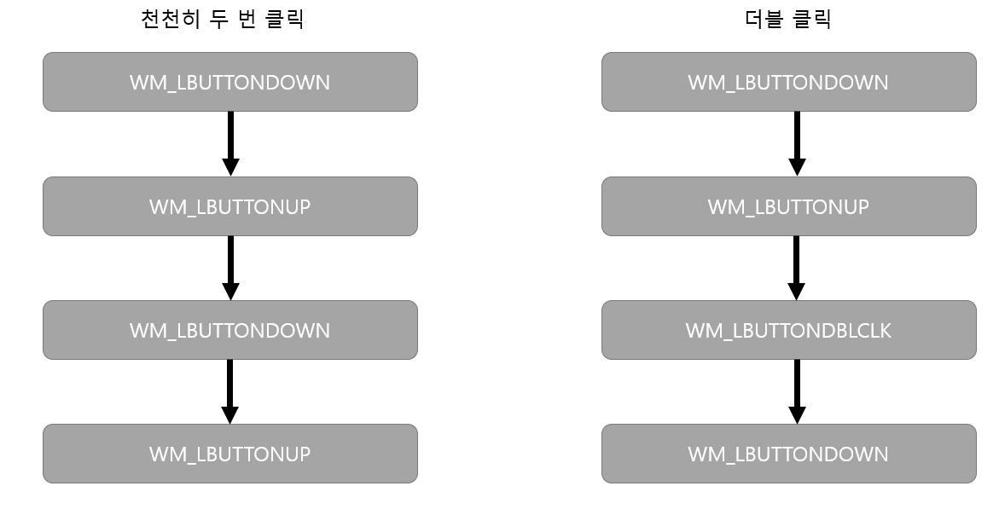

# 마우스 다루기


- 마우스는 시스템에 한 개만 있는 자원이므로 한순간에 한 개의 프로그램만 입력을 받을 수 있다.

- 커서가 뷰 위에 있으면 마우스 메시지가 뷰로, 프레임 윈도우의 타이틀바에 있으면 프레임 윈도우로 전달된다.


- 짧은 간격은 시스템 설정에 따라 달라지는 상대적인 값으로, 윈도우 제어판에서 바꾸거나 ::SetDoubleCLickTime() 함수를 이용해서 특정 프로그램에 한해 값을 바꿀 수 있다.
-------------------------
<br>


## 메시지 맵 & 메시지 핸들러
- 일반적인 윈도우 메시지와 마찬가지로 마우스 메시지도 `메시지 맵`을 이용한다.

```c++
afx_msg void On*(UINT nFlags, CPoint point);
```
- 클라이언트 영역 마우스 메시지 핸들러의 형태이다.

- *부분은 메시지 종류에 따라 달라진다.<br>OnLButtonDown(), OnLButtonUp()

1. afx_msg : 내부에서 공백으로 처리되며 이 함수가 `메시지 핸들러`임을 나타낸다.

2.  nFlags : 메시지가 생성될 당시의 키보드나 마우스 버튼의 `상태`를 나타내며, 비트 마스크 조합으로 이루어져 있다.

| <center> 비트 마스크 </center> | <center> 의미 </center> |
|:--------:|:--------|
| MK_CONTROL | Ctrl 키 누름 |
| MK_SHIFT | Shift 키 누름 |
| MK_LBUTTON | 마우스 왼쪽 버튼 누름 |
| MK_MBUTTON | 마우스 가운데 버튼 누름 |
| MK_RBUTTON | 마우스 오른쪽 버튼 누름 |

- 키보드나 마우스 버튼의 상태를 확인하고 싶으면 nFlags와 해당 비트 마스크를 `& 연산`하여 확인한다.
```C++
void CChildView::OnLButtonDown(UINT nFlags, CPoint point)
{
    if(nFlags & MK_SHIFT)       // Shift 키가 눌렸다면...
    {

    }
}
```
3. point : 메시지가 생성될 당시의 `마우스 커서 위치`를 나타내며, `클라이언트 좌표`로 표시된다.<br> MM_TEXT가 아닌 다른 매핑 모드를 사용하면 장치 좌표와 논리 좌표 간 변환을 해야 올바로 처리할 수 있다.

-------------------
<br>

## 마우스 캡처(Mouse Capture)
- 마우스 커서의 위치에 관계없이 `모든 마우스 메시지`가 특정 윈도우에 전달되게 하는 매커니즘이다.

- 커서가 윈도우 바깥쪽에 있어도 모든 마우스 메시지를 받을 수 있다.

| <center> API 함수 </center> | <center> MFC 함수 </center> | <center> 의미 |
|:--------:|:--------|:-------|
| SetCapure() | CWnd::SetCapture() | 마우스 캡처를 시작한다. |
| ReleaseCapture() | 없음 | 마우스 캡처를 해제한다. |
| GetCapture() | CWnd::GetCaputre() | 어느 윈도우가 현재 마우스 캡처를 하고 있는지 알아낸다. |


---------------------
<br>

## 비클라이언트 영역 마우스 메시지 & 메시지 핸들러
- 클라이언트 영역 마우스 메시지 WM_뒤에 NC를 붙인 이름이다.<br>Ex.) WM_NCLBUTTONDOWN, WM_NCRBUTTONDBLCLK
- 마찬가지로 메시지 맵을 이용하여 메시지 핸들러를 작성하여 메시지를 처리한다.

```C++
afx_msg void OnNc*(UINT hHitTest, CPoint point);
```
1. nHitTest : 메시지가 생성될 당시의 `마우스 커서 위치`를 나타낸다. 커서가 종료 버튼 위에 있었는지 혹은 메뉴 위에 있었는지 등을 알 수 있다.
    - 비클라이언트 영역 마우스 메시지는 보통 운영체제가 처리 하지만, 윈도우의 기본 동작을 바꾸고 싶을 때는 nHitTest 값을 검사해서 특별한 동작을 하게 할 수 있다.


| <center> 상수값 </center> | <center> 의미 </center> |
|:--------|:--------|
| HTCAPTION | 타이틀바 |
| HTCIENT | 클라이언트 영역 |
| HTCLOSE | 종료 버튼 |
| HTHSCROLL | 가로 스크롤바 |
| HTMENU | 메뉴 |
| HTMAXBUTTON, HTZOOM | 최대화 버튼 |
| HTMINBUTTON, HTREDUCE | 최소화 버튼 |
| HTSYSMENU | 시스템 메뉴 |
| HTVSCROLL | 세로 스크롤바 |

2. point : 메시지가 생성될 당시 마우스 커서 좌표를 나타내며, `스크린 좌표`로 되어있다. 

------------
<br>

## 마우스 커서 변경
```C++
HCURSOR SetCursor(HCURSOR hCursor);
```
- hCursor는 커서 리소스를 가리키는 `핸들값`이며 앞으로 사용할 커서를 나타낸다. 

- 커서 리소스를 로드할 때는 `CWinApp::LoadStandardCursor()` 함수를 이용하여 운영체제가 제공하는 목록을 선택할 수도 있고, `CWinApp::LoadCursor()` 함수를 이용하여 직접 제작한 커서를 선택할 수 있다.

- 윈도우 운영체제는 마우스가 움직일 때마다 마우스 커서 아래쪽에 있는 윈도우에 WM_SETCURSOR 메시지를 보냄으로써 커서의 형태를 자유롭게 바꿀 수 있는 기회를 준다.


## 마우스 위치 추적
- 마우스가 윈도우 영역에서 `들어오는` 시점과 `나가는` 시점을 알아야 할 때가 있다.
- `::TrackMouseEvent()` API 함수와 `WM_MOUSELEAVE` 메시지로 마우스가 빠져나가는 시점을 알 수 있다.

```C++
BOOL TrackMouseEvent(LPTRACKMOUSEEVENT lpEventTrack);
```

```C++
typedef struct tagTRACKMOUSEEVENT {
    DWORD cbSize;
    DWORD dwFlags;
    HWND hwndTrack;
    DWORD dwHoverTime;
} TRACKMOUSEEVENT, *LPTRACKMOUSEEVENT;
```
1. cbSize : 구조체 크기
2. dwFlags : TME_LEAVE를 대입한다.
3. hwndTrack : WM_MOUSELEAVE 메시지를 받을 윈도우 핸들이다.
4. dwHoverTime : HOVER_DEFAULT를 대입한다.

※ ::TrackMouseEvent() 함수로 요청한 WM_MOUSELEAVE는 `한 번`만 발생하므로 필요시 다시 호출해야한다.