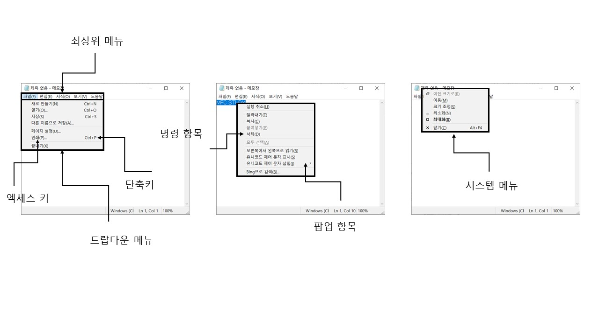

# Menu
- 응용 프로그램에서 선택할 수 있는 `명령의 집합`으로, `계층구조`로 이루어진 사용자 인터페이스다.

## 메뉴 기초



| <center> 용어 </center> | 의미 |
|-------|------|
| 명령 항목 | 명령을 수행하는 메뉴 항목 <br> 선택시 `WM_COMMAND` 메시지가 발생 |
| 팝업 항목 | 하위 메뉴를 표시하는 항목 <br> 선택시 `WM_COMMAND` 메시지가 발생 |

<br><br>

# 메뉴 생성
1. 리소스를 이용한 메뉴 생성
    - 메뉴 리소스를 정의하여 실행 파일에 포함시킨 후 프로그램 실행 중에 로드하여 사용한다.

2. 코드를 이용한 메뉴 생성
    - 코드를 실행하여 메뉴를 생성한 후 윈도우에 붙여서 사용한다.


### 리소스를 이용한 메뉴 생성
- 메뉴 리소스를 프로젝트에 추가할 수 있고, 여러개 만들어 두어 프로그램 실행 중 `선택하여 로드`할 수 있다.

- `CFrameWnd::LoadFrame()` 함수는 프레임 윈도우를 생성한 후 프레임 윈도우와 프레임 윈도우 객체를 연결하는 역할을 한다. 이 때 IDR_MAINFRAME 값을 이용하여 동일한 이름의 리소스를 로드한다.

- VisualStudio에서 메뉴를 추가하고 메뉴 항목의 속성등을 설정할 수 있다.

| 속성 | 의미 |
|------|------|
| ID | 항목을 구분할 수 있는 번호 
| Separator | 구분선 추가 여부 
| Caption | 화면에 보이는 문자열 <br> 이때 실행키를 주려면 문자 앞에 & 기호를 붙여서 사용
| Checked | 체크 표시 여부 
| Grayed | 메뉴 항목이 흐리게 표시되어 사용할 수 없음을 나타내고자 할 때 
| Popup | 팝업 항목으로 전환 (펼쳐지는 형식으로 만듬) 
| Right Justify | 윈도우 오른쪽 끝에 메뉴 항목을 표시


### 코드를 이용한 메뉴 생성
- CMenu 클래스를 이용하여 메뉴의 기능을 C++코드로 제어할 수 있다.

- CCmdUI 클래스를 이용하여 메뉴와 툴바 및 상태바에 필요한 일부 기능을 지원한다.
- 리소스를 이용한 방법보다 불편하여 메뉴 전체를 만들기보다는 `기존 메뉴를 수정`할 때 사용하는 것이 좋다.


### 메뉴 전체를 만드는 방법
```C++
int CMainFrame::OnCreate(LPCREATESTRUCT lpCreateStruct)
{
    // ...
    CMenu menuMain;
    menuMain.CreateMenu();

    CMenu menuPopup;
    menuPopup.CreatePopupMenu();

    menuPopup.AppendMenu(MF_STRING, 201, _T("빨간색(&R)"));
    menuPopup.AppendMenu(MF_STRING, 202, _T("초록색(&G)"));
    menuPopup.AppendMenu(MF_STRING, 203, _T("파란색(&B)"));

    menuMain.AppendMenu(MF_POPUP, (UINT)menuPopup.Detach(), _T("색상(&C)"));

    SetMenu(&MmenuMain);
    menuMain.Detach();

    return 0;
}
```

- CMenu::CreateMenu() : 비어 있는 최상위 메뉴를 만들고 메뉴 객체와 연결(Attach)한다.

- CMenu::CreatePopupMenu() : 비어 있는 팝업 메뉴를 만들고 메뉴 객체와 연결한다.

- CMenu::AppendMenu() : 새로운 메뉴 항목을 메뉴에 추가한다.
```C++
BOOL AppendMenu(UINT nFlags, UINT_PTR nIDNewItem = 0, LPCTSTR lpszNewItem = NULL);
```
- nFlags는 새로 추가될 메뉴 항목의 정보를 제공하고, 두 번째와 세 번째인자의 의미가 이에따라 달라진다.

|<center> nFlags | | <center>nIDNewItem | <center>lpszNewItem |
|-------|------|------------|-------------|
| MF_STRING | 메뉴항목이 문자열이다. | 새로운 메뉴 항목의 ID | 메뉴 항목의 캡션 문자열 |
| MF_POPUP | 메뉴 항목이 팝업 메뉴를 가진다. | 팝업 메뉴를 가리키는 핸들(HWND 타입) | 메뉴 항목의 캡션 문자열 |
| MF_CHECKED <br> MF_UNCHECKED <br> MF_ENABLED <br> MF_DIABLED <br> MF_GRAYED | 메뉴 항목의 속성(Checked, Enabled, Grayed)을 나타내는 값이다.  | |
| MF_SEPARATOR | Separator 속성을 설정한 것과 의미가 동일하다. | 사용되지 않음 | 사용되지 않음 |


## 기존 메뉴에 추가하는 방법
```C++
int CMainFrame::OnCreate(LPCREATESTRUCT lpCreateStruct)
{
    // ...
    // 동일하게 메뉴와 팝업을 생성한다.

    CMenu *pTopLevel = GetMenu();
    pTopLevel->AppendMenu(MF_POPUP, (UINT)Popup.Detach(), _T("테스트(&T"));

    return 0;
} 
```
<br><br>

# 메뉴 명령 처리
- 명령 항목은 명령을 수행하는 핵심이다.

- 명령 항목을 마우스나 키보드로 선택하면 운영체제는 WM_COMMAND 메시지를 발생시키며, 이 메시지와 더불어 메뉴 항목의 ID를 메뉴가 속한 윈도우에 보낸다.

- 명령 항목별로 처리 함수를 따로 작성할 수 있게 해주는 `명령 핸들러(Command Handler)`를 작성한다.

- `명령 라우팅(Command Routing)`을 이용하여 어느 클래스에 명령 핸들러를 추가하더라도 처리가 된다.

<br><br>

# 메뉴 항목 갱신
- 현재 선택한 메뉴에 따라 메뉴 항목에 `특별한 표시`를 하거나 메뉴 항목을 `활성화` 또는 `비활성화`할 필요가 있다.

- 각 메뉴 항목의 상태를 `갱신`하기 위한 함수인 `명령 갱신 핸들러(COmmand Update Handler)`를 작성할 수 있다.

```C++
void CChidView::OnUpdateColorRed(CCmdUI* pCmdUI)
{
}
```

- `CCmdUI 포인터`를 인자로 받는 간단한 함수이다.

- 프로그래머가 호출하는 것이 아닌 내부 코드에서 자동으로 호출된다. 

- CCmdUI 포인터가 가리키는 대상에 맞게 메뉴 상태를 바꾸거나, 툴바 또는 상태바의 상태를 바꿀 수 있다.

| <center>멤버 함수 | <center> 기능 | <center>사용 예 |
|----------|------|--------|
| Enable() | 활성화 상태 변경 | pCmdUI->Enable(bDawMode);
| SetCheck() | 체크 상태 변경 | pCmdUI->SetCheck(m_color == RGB(255, 0, 0));
| SetRadio() | 라디오 표시 상태 변경 | pCmdUI->SetRadio(m_color = RGB(255, 0, 0));
| SetText() | 문자열 변경 | pCmdUI->SetText(_T("Light On"));

<br><br>

# 컨텍스트 메뉴
- 컨텍스트 메뉴(단축 메뉴)는 마우스 오른쪽 버튼을 누를 때 열린다.

- 커서 위치 또는 현재 하는 작업에 따라 서로 다른 메뉴 항목을 표시한다.

- 윈도우 운영체제는 컨텍스트 메뉴를 지원하기 위해 `WM_CONTEXTMENU` 메시지를 제공한다.
    - 클라이언트 영역이나 비클라이언트 영역에서 마우스 오른쪽 버튼을 누른 경우
    - shif + F10키를 누른 경우
    - 가상 키 코드 VK_APPS에 해당하는 키를 누른 경우

- 윈도우 운영체제는 `디폴트 컨텍스트 메뉴`도 제공한다(타이틀바에서 마우스 오른쪽)

- MFC에서 컨테스트 메뉴를 구현하려면 WM_CONTEXTMENU 메시지 핸들러를 작성한다.
```C++
afx_msg void CWnd::OnContextMenu(Cwnd* pWnd, CPoint pos);
// pWnd : 마우스 커서 아래쪽에 있는 윈도우
// pos  : 마우스 커서의 위치(스크린 좌표)
```

- WM_CONTEXTMENU 메시지 핸들러인 OnContextMenu() 함수에서는 팝업 메뉴를 화면에 표시하는 코드를 작성해야 하는데, 이 때 `CMenu::TrackPopupMenu()` 함수를 사용한다.

- 메뉴 항목의 위치를 나타내는 번호는 0부터 시작한다.

```C++
BOOL TrackPopupMenu(UINT nFlags, int x, int y, CWnd*pWnd, LPCRECT lpRect = 0);
```
1. nFlags : 두 종류의 플래그가 있다. 
    - 첫 번쨰는 마우스 커서의 x좌표를 기준으로 `컨텍스트 메뉴의 정렬 위치`를 결정하는 값이다. TPM_LEFTALIGN, TPM_CENE RALIGN, TPN_RIGHTALIGN을 사용한 결과이다.

    - 두 번쨰는 `메뉴 항목을 선택할 수 있는 마우스 버튼`을 결정하는 값으로 TPM_LEFBUTTON과 TPM_RIGHTBUTTON이 있다. 마우스 왼쪽 버튼으로 메뉴항목을 선택하는 것이 기본값이며, 오른쪽 버튼으로도 선택할 수 있다.

2. x, y : 컨텍스트 메뉴가 표시될 `스크린 좌표`를 나타낸다.

3. pWnd : 컨텍스트 메뉴에서 발생한 `WM_COMMAND 메시지를 처리할 윈도우`를 나타낸다. 대개 프레임 윈도우 객체의 주소를 사용한다.

4. lpRect : 스크린 좌표로 정의된 직사각형 좌표로, 이 직사각형 영역 안에서는 마우스 버튼을 눌러도 컨텍스트 메뉴가 닫히지 않는다. 기본값 0 그대로 사용하는 경우가 많은데, 컨텍스트 메뉴 영역 이외의 위치에서 마우스버튼을 클릭하면 컨텍스트 메뉴가 닫힌다. 

<br><br>

# 시스템 메뉴
- 윈도우 `좌상단의 아이콘` `타이틀바에서 마우스 오른쪽` 버튼을 누를 때 표시되는 메뉴로, 윈도우 조작과 관련된 몇 가지 기능을 기본으로 제공한다.

- 일반 메뉴와 비슷하게 CWnd::GetSystemMenu() 함수를 이용해 시스템 메뉴를 가리키는 CMenu 포인터를 얻은 후, CMenu 클래스가 제공하는 다양한 멤버함수를 적용한다.
    - 시스템 메뉴를 `변경`하려면 GetSystemMenu(FALSE) 함수를 호출하고, 반대로 시스템 메뉴를 `초기 상태`로 되돌리려면 GetSystemMenu(TRUE) 함수를 호출한다.

    - 시스템 네ㅠ에 새로운 항목을 추가할 때 메뉴 ID는 반드시 `16의 정수배`여야 하고 `0xF000`보다 작은 값이어야 한다.

    - 시스템 메뉴 항목을 선택하면 WM_COMMAND가 아닌 `WM_SYSCOMMAND` 메시지가 발생한다.

<br><br>

# 가속기
- 메뉴 항목을 곧바로 실행할 수 있는 `키 조합` == 단축키

- 메뉴 항목처럼 WM_COMMAND 메시지가 발생하여 명령 핸들러가 호출된다.

- 모든 가속기 메시지는 프레임 윈도우가 받는다(일반적인 키보드 메시지와 다름).

