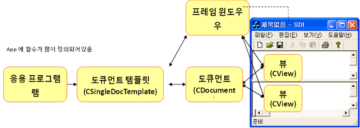

# 도큐먼트/뷰 구조
- 직렬화를 이용해 파일 입출력을 하기 위해서는 도큐먼트 / 뷰 구조를 적용하여 프로그램을 작성하여야한다.


## 개요
- 도큐먼트/뷰 구조는 응용 프로그램에서 사용할 데이터를 관리하는 기능과 데이터를 화면에 표시하는 기능을 분리하여 구현한다는 개념에 기초한다.

- 데이터 관리 기능을 도큐먼트, 화면에 표시하는 기능을 뷰라고 부른다.

- MFC에서는 이들이 C++ 클래스 형태로 존재하므로 도큐먼트 클래스, 뷰 클래스라는 용어를 사용한다.


| <center> 클래스 </center> | <center> 역할 </center> |
|:--------:|:--------|
| 도큐먼트 | 데이터를 저장하거나 읽어들인다. <br> 데이터의 변경 사항이 생기면 뷰의 화면을 갱신한다.
| 뷰 | 데이터를 화면에 표시한다. <br> 사용자와의 상호 작용을 담당한다. |
- 서로 다른 기능을 분리해서 구현하므로 개념적으로 이해하기 쉽고, 독립성이 높은 기능은 별도의 모듈로 구현하는 것이 바람직하다.

- 하나의 도큐먼트에 뷰가 여러 개 존재하는 모델을 구현하기 쉽다.

- 직렬화 등의 부가 서비스를 이용할 수 있다.

## 도큐먼트 템플릿 클래스(Document Template)
- CSingleDocTemplate 클래스는 응용 프로그램에서, CMultiDocTemplaye 클래스는 MDI 응용 프로그램에서 사용한다.

- 도큐먼트 템플릿은 도큐먼트, 프레임 윈도우, 뷰 클래스의 정보를 유지하며 필요에 따라 객체를 동적으로 생성한다.

- 보통 도큐먼트 템플릿을 하나만 사용하지만 여러 개를 사용하는 경우도 있다.

```C++
BOOL CFileIOTestApp::InitInstance()
{
    CSingleDocTemplate* pDOcTemplate;
    pDocTemplate = new CSingleDocTemplate(
        IDR_MAINFRAME,                      // 리소스 ID
        RUNTIME_CLASS(CFileIOTestDoc),      // 도큐먼트 클래스 정보
        RUNTIME_CLASS(CMainFrame),          // 프레임 윈도우 정보
        RUNTIME_CLASS(CFileIOTestView));    // 뷰 클래스 정보

    if(!pDocTemplate)
        return FALSE;
    AddDocTemplate(pDocTemplate);           // 응용 프로그램 객체에 도큐먼트 템플릿 등록
}
```
- 응용 프로그램 마법사로 도큐먼트/뷰 구조를 지원하는 MFC 응용 프로그램을 생성한 후 InitInstance() 함수를 찾아보면 다음 코드를 볼 수 있다.

- 도큐먼트 템플릿 클래스 객체를 생성하고, 응용 프로그램 객체에 등록하는 부분이다.

- 도큐먼트, 프레임 윈도우, 뷰 클래스 정보는 물론이고 프로그램에서 사용할 리소스 정보도 같이 넘겨준다.


| <center> 생성 주체 </center> | <center> 생성되는 것 </center> |
|:--------:|:--------|
| 1 응용 프로그램 객체 | 2 도큐먼트 템플릿 객체 |
| 도큐먼트 템플릿 객체 | 3 도큐먼트 객체, 4 프레임 윈도우 객체 |
| 프레임 윈도우 객체 | 5 뷰 객체 |
※ 번호는 생성 순서를 나타낸다.



<br><br>

# 도큐먼트/뷰 구조 분석
-비주얼 C++ 자동 생성 코드 이해하기

## 응용프로그램 클래스
```C++
// Doc_View_Struct.cpp
BEGIN_MESSAGE_MAP(CDocViewStructApp, CWinApp)
	ON_COMMAND(ID_APP_ABOUT, &CDocViewStructApp::OnAppAbout)
	// 1
    ON_COMMAND(ID_FILE_NEW, &CWinApp::OnFileNew)						// 파일 - 새파일
	ON_COMMAND(ID_FILE_OPEN, &CWinApp::OnFileOpen)						// 파일 - 열기
	ON_COMMAND(ID_FILE_PRINT_SETUP, &CWinApp::OnFilePrintSetup)			// 파일 - 인쇄 설정
END_MESSAGE_MAP()

// 중략...

BOOL CDocViewStructApp::InitInstance()
{
	//중략...
    // 2
    LoadStdProfileSettings(4);

    // 3
	CSingleDocTemplate* pDocTemplate;
	pDocTemplate = new CSingleDocTemplate(
		IDR_MAINFRAME,
		RUNTIME_CLASS(CDocViewStructDoc),
		RUNTIME_CLASS(CMainFrame),       // 주 SDI 프레임 창입니다.
		RUNTIME_CLASS(CDocViewStructView));
	if (!pDocTemplate)
		return FALSE;
	AddDocTemplate(pDocTemplate);

    // 4
	CCommandLineInfo cmdInfo;
	ParseCommandLine(cmdInfo);

    // 5
	if (!ProcessShellCommand(cmdInfo))
		return FALSE;

    // 6
	m_pMainWnd->ShowWindow(SW_SHOW);
	m_pMainWnd->UpdateWindow();

	return TRUE;
}
```
1. 순서대로 주석의 메뉴 핸들러를 CWinApp클래스가 기본으로 제공한다.
2. 가장 최근에 사용한(MRU; Most Recently Used)파일 목록을 로드한다.
3. 도큐먼트 템플릿 객체를 동적으로 생성한 후 응용 프로그램 객체에 등록한다.
4. 명려행 인자를 분석하고 그 결과를 cmdInfo 객체에 저장한다.
5. cmdInfo 객체의 내용에 따라 적절히 처리한다. 이 과정에서 도큐먼트, 프레임 윈도우, 뷰 객체가 생성된다.
6. 생성된 프레임 윈도우를 화면에 보이고, CWnd::UpdateWindow() 함수를 호출하여 WM_PAINT 메시지 핸들러를 실행시킨다.


## 프레임 윈도우 클래스
```C++
class CMainFrame : public CFrameWnd
{
    protected:
    // ...
	DECLARE_MESSAGE_MAP()
    // ...
};
```

```C++
//...
IMPLEMENT_DYNCREATE(CMainFrame, CFrameWnd)
//...
```
- 프레임 윈도우 객체는 `CWinApp::ProcessShellCommand()` 함수를 수행하는 과정에서 `동적`으로 생성된다. 동적 객체 생성 기능을 지원하기 위해 헤더와 구현 파일에 각각 매크로를 사용한다.


## 뷰 클래스
```c++
// view.h
class CDocViewStructView : public CView
{
    protected:
    // ... 1
	DECLARE_MESSAGE_MAP()
    // ... 2
    public:
	CDocViewStructDoc* GetDocument() const;
    // ... 3
    public:
	virtual void OnDraw(CDC* pDC);
    // ... 4
    protected:
	virtual BOOL OnPreparePrinting(CPrintInfo* pInfo);
	virtual void OnBeginPrinting(CDC* pDC, CPrintInfo* pInfo);
	virtual void OnEndPrinting(CDC* pDC, CPrintInfo* pInfo);
    // ...
}:

#ifndef _DEBUG 
// 5
inline CDocViewStructDoc* CDocViewStructView::GetDocument() const
   { return reinterpret_cast<CDocViewStructDoc*>(m_pDocument); }
#endif
```

```c++
/// View.cpp
// ... 6
IMPLEMENT_DYNCREATE(CDocViewStructView, CView)

BEGIN_MESSAGE_MAP(CDocViewStructView, CView)
	// 7
	ON_COMMAND(ID_FILE_PRINT, &CView::OnFilePrint)
	ON_COMMAND(ID_FILE_PRINT_DIRECT, &CView::OnFilePrint)
	ON_COMMAND(ID_FILE_PRINT_PREVIEW, &CView::OnFilePrintPreview)
END_MESSAGE_MAP()

// ... 8
void CDocViewStructView::OnDraw(CDC* pDC)
{
	CDocViewStructDoc* pDoc = GetDocument();
	ASSERT_VALID(pDoc);
	if (!pDoc)
		return;

	// TODO: 여기에 원시 데이터에 대한 그리기 코드를 추가합니다.
	pDC->SetMapMode(MM_LOMETRIC);
	pDC->Rectangle(50, -50, 550, -550);
	pDC->Ellipse(600, -50, 1100, -550);
}

// ... 9
BOOL CDocViewStructView::OnPreparePrinting(CPrintInfo* pInfo)
{
	// 기본적인 준비
	return DoPreparePrinting(pInfo);
}

void CDocViewStructView::OnBeginPrinting(CDC* /*pDC*/, CPrintInfo* /*pInfo*/)
{
	// TODO: 인쇄하기 전에 추가 초기화 작업을 추가합니다.
}

void CDocViewStructView::OnEndPrinting(CDC* /*pDC*/, CPrintInfo* /*pInfo*/)
{
	// TODO: 인쇄 후 정리 작업을 추가합니다.
}

// ... 10
CDocViewStructDoc* CDocViewStructView::GetDocument() const
{
	ASSERT(m_pDocument->IsKindOf(RUNTIME_CLASS(CDocViewStructDoc)));
	return (CDocViewStructDoc*)m_pDocument;
}
```

- 1, 6 뷰 클래스가 동적 객체  생성 기능을 지원할 수 있도록 매크로를 사용

- 2, 5, 10 뷰는 사용자가 입력한 데이터를 저장하거나 저장된 데이터를 읽어오기 위해 빈번하게 도큐먼트 객체에 접근해야한다. CView 클래스의 멤버 변수인 m_pDocument는 CDocument 타입 포인터로, 뷰가 생성되는 과정에서 도큐먼트 객체의 주소로 초기화된다. 따라서 언제든 뷰 객체에서 도큐먼트 객체를 참조할 수 있다.
    - 여기서 GetDocumnet() 함수는 m_pDocument를 구체적인 클래스 타입(프로젝트이름DOC*)으로 변환 후 리턴한다.
    - 5는 릴리스 버전, 10은 디버그 버전으로 컴파일할 때 사용한다.

- 3, 8 도큐먼트/뷰 구조 응용 프로그램은 OnPaint() 대신 OnDraw() 함수가 사용된다. OnPaint() 함수와 달리 OnDraw() 함수에서는 DC 객체를 생성할 필요가 없다. MFC 내부 코드에서 적당한 DC를 미리 생성하여 넘겨주기 떄문이다.
    - 화면 출력을 비롯하여 인쇄와 인쇄 미리보기에도 사용된다.

- 4, 9 인쇄와 관련해서 자동으로 호출되는 멤버 함수다. OnPreparePrinting() 함수는 파일 - 인쇄 선택시, OnBeginPrinting()과 OnEndPrinting() 함수는 인쇄와 인쇄 미리보기가 시작되는 시점과 끝나는 시점에 호출된다.

- 7 인쇄와 인쇄 미리 보기 기능을 CView 클래스가 기본으로 제공한다.

## 도큐먼트 클래스
```c++
//Doc.h
class CDocViewStructDoc : public CDocument
{
protected: // serialization에서만 만들어집니다.
	CDocViewStructDoc() noexcept;
    // ... 1
	DECLARE_DYNCREATE(CDocViewStructDoc)

public:
    // 2
	virtual BOOL OnNewDocument();
    // 3
	virtual void Serialize(CArchive& ar);
#ifdef SHARED_HANDLERS
    // ... 
#endif // SHARED_HANDLERS

public:
	virtual ~CDocViewStructDoc();
#ifdef _DEBUG
	virtual void AssertValid() const;
	virtual void Dump(CDumpContext& dc) const;
#endif

protected:
	DECLARE_MESSAGE_MAP()

#ifdef SHARED_HANDLERS
    // ... 
#endif // SHARED_HANDLERS
};
```

```c++
// Doc.cpp
// 4
IMPLEMENT_DYNCREATE(CDocViewStructDoc, CDocument)

BEGIN_MESSAGE_MAP(CDocViewStructDoc, CDocument)
END_MESSAGE_MAP()

CDocViewStructDoc::CDocViewStructDoc() noexcept
{
}

CDocViewStructDoc::~CDocViewStructDoc()
{
}

// 5
BOOL CDocViewStructDoc::OnNewDocument()
{
	if (!CDocument::OnNewDocument())
		return FALSE;

	return TRUE;
}

// 6
void CDocViewStructDoc::Serialize(CArchive& ar)
{
	if (ar.IsStoring())
	{
		// TODO: 여기에 저장 코드를 추가합니다.
	}
	else
	{
		// TODO: 여기에 로딩 코드를 추가합니다.
	}
}

#ifdef SHARED_HANDLERS
    // ... 
#endif // SHARED_HANDLERS

// CDocViewStructDoc 진단

#ifdef _DEBUG
void CDocViewStructDoc::AssertValid() const
{
	CDocument::AssertValid();
}

void CDocViewStructDoc::Dump(CDumpContext& dc) const
{
	CDocument::Dump(dc);
}
#endif //_DEBUG
```

- 1, 4 : 도큐먼트 클래스가 동적 생성 가능하도록 매크로를 설정한다.

- 2, 5 : OnNewDocumnet() 함수는 파일 - 새로 만들기 메뉴를 선택했을 때 자동으로 호출된다.
    - 새로운 문서로 작업을 시작할 때마다 필요한 초기화 코드가 있다면 여기에 추가한다.

- 3, 6 : CObject::Serialize() 가상 함수를 재정의한 것으로, 직렬화 기능과 관련 있다. 데이터를 저장하거나 읽어오는 코드를 여기에 추가한다.